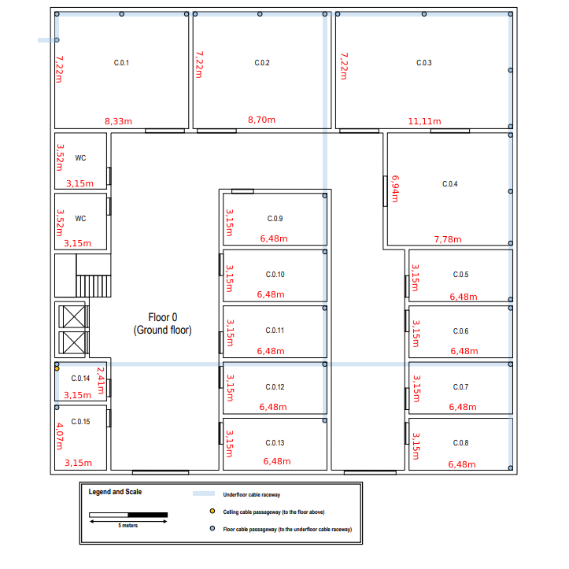
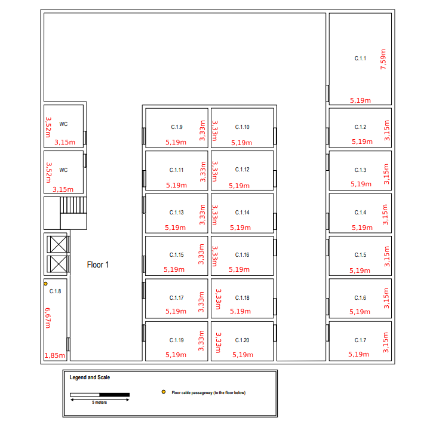

## RCOMP 2022/2023 - SPRINT 1 EDIFÍCIO C - 1201551 ##

===========================================================================

### Introdução: ###
Este ficheiro documenta o planeamento e estruturação do Edifício C, que se encontra dividido em dois pisos.

------------------------------------------------------------------------------------------------------------------------------------------------------------

### Índice: ###

1. **Regras de cabeamento e visão geral da estrutura do Edifício C**

------------------------------------------------------------------------------------------------------------------------------------------------------------

### 1. Regras de cabeamento e estruturação geral do Edifício C ###

_1.1 Informação geral_

As seguintes especificacões do edifício C foram fornecidas pelo enunciado:

* Dimensões horizontais de 30x30 metros.

  __Piso 0__
  * O piso térreo possui uma vala técnica subterrânea com canaletas de cabos, conectada a uma vala técnica externa.
  * O acesso à vala técnica subterrânea está disponível em pontos específicos no piso térreo, representados em azul na planta do piso térreo.
  * A altura do teto no piso térreo é de 4 metros. 
  * Corredores, casas de banho e átrios não requerem tomadas de rede.
  * O espaço C.0.14 é de armazenamento e como tal não requer tomadas de rede, no entanto pode conter um cross-connect.
  * Os espaços C.0.1, C.0.2 e C.0.3 têm propósitos específicos e as únicas tomadas de rede necessárias, são duas perto de cada passagem de cabos de piso.
    Em qualquer outro lugar, o padrão de número de tomadas de rede por área deve ser aplicado.

  __Piso 1:__
  * O primeiro piso tem uma altura de teto de 3 metros, no entanto existe um teto rebaixado amovível, colocado a 2,5 metros do chão, cobrindo todo o andar. 
  * Este andar não possui canaletas de cabos subterrâneos.
  * Common areas and restrooms are not required to have network outlets, other rooms should be provided
    with the standard number of network outlets. Room C.1.8 is a storage area, no network outlets are
    required there as well, and it may be used to house a cross-connect and other network infrastructure
    hardware.
  * Áreas comuns e casas de banho não necessitam de tomadas de rede, outras salas devem ser fornecidas com o número padrão de tomadas de rede.
  * O espaço C.1.8 de armazenamento e como tal não requer tomadas de rede, no entanto pode conter um cross-connect e outros dispositivos de infraestrutura de rede.

                                                              Planta do piso 0 (retirada do enunciado):

  

                                                              Planta do piso 1 (retirada do enunciado):

  

_1.2 Número de tomadas de rede_

Indo de encontro às especificações fornecidas pelo enunciado, serão necessárias 2 tomadas de rede por cada 10 metros quadrados de área.

_1.3 Cabeamento_

Ambos os padrões de cabeamento **568A** e **568B** para redes Ethernet podem ser usados com vários tipos de cabos de cobre, incluindo cabos de Categoria 5e
(Cat5e), Categoria 6 (Cat6) e Categoria 6a (Cat6a). O cabo *Cat6a* fornece um **desempenho bastante alto** e pode suportar **taxas de transferência de dados
de até 10 GB/s** em distâncias de **até 100 metros**. É recomendado para aplicações de alta performance que exigem **conectividade confiável** e de **alta
velocidade** em distâncias maiores.

**Cat7** é um tipo de cabo de cobre projetado para suportar a **rede Ethernet de alta velocidade a taxas de transferência de dados** ainda mais altas e em
distâncias maiores do que o Cat6a. É um cabo **totalmente blindado** (STP), o que proporciona **melhor resistência ao ruído e interferência** do que cabos
não blindados como o Cat5e e o Cat6.

No entanto, é importante realçar que o Cat7 **não é um padrão oficialmente reconhecido pela Telecommunications Industry Association (TIA) ou pela International
Organization for Standardization (ISO)**. Embora esteja amplamente disponível, sua **compatibilidade com outros equipamentos de rede e sua prova futura não são
garantidos**. Como resultado, o Cat6a é frequentemente a escolha preferida para instalações Ethernet de alto desempenho, e vai ser também utilizado no cabeamento
deste edifício.

Como fios de fibra vão ser utilizados **cabos de fibra ótica de modo único**, também conhecidos como monomodo. São projetados para **transmitir sinais de luz num
único caminho**. Eles são feitos com um **núcleo menor e mais denso** do que os cabos de modo múltiplo, permitindo que os **sinais de luz sejam transmitidos em
distâncias maiores com menos atenuação de sinal**. As únicas desvantagens destes cabos são **o custo**, que é mais elevado do que os cabos de modo múltiplo, e a
**menor resistência a danos físicos**.

_1.4 Cross-conection_

Os cross-connects são normalmente instalados em **DataCenters**, centrais telefónicas e outras instalações de telecomunicações. Eles fornecem uma maneira eficiente
de gerenciar e organizar as conexões entre vários componentes de rede, como switches, routers e servidores. Nesta planta existem um **MC (Main Cross-Connect)**, um
**IC (Intermediate Cross-Connect)** e dois **HC's (Horizontal Cross-Connect)**. Podemos estimar que **a área total abrangida pelo HC não deve exceder os 1000 m2** e
que **a distância máxima entre uma tomada e um HC** deve ser de, aproximadamente, **80 metros**. Relativamente às **distâncias entre os cross-connects**, cada uma
não deve exceder os **500 metros**.

_1.5 Access Points_

**Access points (APs)** são dispositivos de rede sem fio que **permitem que os dispositivos clientes se conectem a uma rede sem fio**. Os access points são usados
em redes sem fio para **estender a cobertura da rede e fornecer conectividade sem fio em áreas onde o sinal do router ou do switch não alcança**. Eles normalmente
são conectados a um switch ou router de rede com fio para fornecer uma conexão de rede sem fio. Um access point tem uma cobertura de cerca de **30 a 50 metros de
raio**.

_1.6 Patch Panels, Path Cords, Consolidation Points e Switches_

Dado que estaremos a utilizar cabos Cat6a, todas as restantes ligações e dispositivos utilizarão também Cat6a.

Um **patch cord** é um cabo curto com conectores em ambas as extremidades que é usado para conectar um dispositivo de rede a um patch panel, ou para interconectar
diferentes componentes de rede, como switches, routers ou firewalls.

Um **patch panel** é um painel que possui vários conectores que são usados para conectar diferentes dispositivos de rede a um sistema de cabeamento estruturado.

Em geral, os patch panels e patch cords são usados em conjunto para **criar uma infraestrutura de rede organizada e confiável**, permitindo que os cabos sejam
facilmente gerenciados e conectados, **reduzindo os custos de manutenção e aumentando a eficiência do sistema de cabeamento estruturado**.

Em geral, os **Consolidation Points (CPs)** são instalados em áreas centralizadas e acessíveis, e o seu objetivo é permitir que **novas conexões sejam adicionadas
ou reorganizadas com facilidade, sem ter que alterar o cabo principal** (é conectado ao cabo de rede principal, que por sua vez é conectado a um switch ou router).
Em suma, ao instalar estes dispositivos em cada piso do edifício, deve ter-se em conta a posição dos mesmos já que uma posição estratégica irá diminuir os custos
totais da obra.

------------------------------------------------------------------------------------------------------------------------------------------------------------

### 2. Medidas e dimensões das divisões ###

As seguintes medidas foram calculadas com base nas plantas e escala fornecidas pelo enunciado.
Seguem-se duas imagens, relativas aos dois pisos, com as medidas e áreas de cada divisão (valores aproximados, resultantes da conversão da escala).

                                                                                 Planta do piso 0 com as medidas:

  

                                                              Planta do piso 1 com as medidas:

  

Tendo as medidas das paredes, podemos calcular a área de cada uma das divisões.

Piso 0:

| Divisão | Largura (m) | Comprimento (m) | Área (m2) |
|--------:|:-----------:|:---------------:|:---------:|
|   C.0.1 |    7,22     |      8,33       |   60,14   |
|   C.0.2 |    7,22     |      8,70       |   62,81   |
|   C.0.3 |    7,22     |      11,11      |   80,21   |
|   C.0.4 |    6,94     |      7,78       |   38,06   |
|   C.0.5 |     4--     |       --        |    --     |
|   C.0.6 |     --      |       --        |    --     |
|   C.0.7 |     --      |       --        |    --     |
|   C.0.8 |     --      |       --        |    --     |
|   C.0.9 |     --      |       --        |    --     |
|  C.0.10 |     --      |       --        |    --     |
|  C.0.11 |     --      |       --        |    --     |
|  C.0.12 |     --      |       --        |    --     |
|  C.0.13 |     --      |       --        |   ----    |
|  C.0.14 |     --      |       --        |    ---    |
|  C.0.15 |     --      |       --        |    --     |
