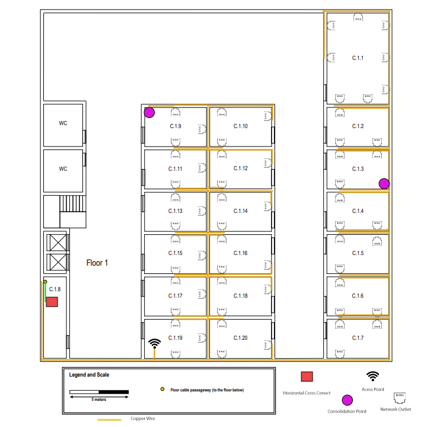

## RCOMP 2022/2023 - SPRINT 1 EDIFÍCIO C - 1201551 ##

===========================================================================

### Introdução: ###
Este ficheiro documenta o planeamento e estruturação do Edifício C, que se encontra dividido em dois pisos.

------------------------------------------------------------------------------------------------------------------------------------------------------------

### Índice: ###

1. **Regras de cabeamento e visão geral da estrutura do Edifício C**
2. **Medidas e dimensões das divisões**
3. **Cabeamento e instalação dos dispositivos**
4. **Materiais necessários**
5. **Hardware total necessário (inventário)**

------------------------------------------------------------------------------------------------------------------------------------------------------------

### 1. Regras de cabeamento e estruturação geral do Edifício C ###

_1.1 Informação geral_

As seguintes especificacões do edifício C foram fornecidas pelo enunciado:

* Dimensões horizontais de 30x30 metros.

  __Piso 0__
  * O piso térreo possui uma vala técnica subterrânea com canaletas de cabos, conectada a uma vala técnica externa.
  * O acesso à vala técnica subterrânea está disponível em pontos específicos no piso térreo, representados em azul na planta do piso térreo.
  * A altura do teto no piso térreo é de 4 metros. 
  * Corredores, casas de banho e átrios não requerem tomadas de rede.
  * O espaço C.0.14 é de armazenamento e como tal não requer tomadas de rede, no entanto pode conter um cross-connect.
  * Os espaços C.0.1, C.0.2 e C.0.3 têm propósitos específicos e as únicas tomadas de rede necessárias, são duas perto de cada passagem de cabos de piso.
    Em qualquer outro lugar, o padrão de número de tomadas de rede por área deve ser aplicado.

  __Piso 1:__
  * O primeiro piso tem uma altura de teto de 3 metros, no entanto existe um teto rebaixado amovível, colocado a 2,5 metros do chão, cobrindo todo o andar. 
  * Este andar não possui canaletas de cabos subterrâneos.
  * Common areas and restrooms are not required to have network outlets, other rooms should be provided
    with the standard number of network outlets. Room C.1.8 is a storage area, no network outlets are
    required there as well, and it may be used to house a cross-connect and other network infrastructure
    hardware.
  * Áreas comuns e casas de banho não necessitam de tomadas de rede, outras salas devem ser fornecidas com o número padrão de tomadas de rede.
  * O espaço C.1.8 de armazenamento e como tal não requer tomadas de rede, no entanto pode conter um cross-connect e outros dispositivos de infraestrutura de rede.

                                                              Planta do piso 0 (retirada do enunciado):

  

                                                              Planta do piso 1 (retirada do enunciado):

  

_1.2 Número de tomadas de rede_

Generalizando, um espaço de escritório padrão pode exigir aproximadamente uma tomada de rede a cada 10 a 15 metros quadrados, enquanto um espaço residencial
pode exigir uma tomada de rede a cada 20 a 30 metros quadrados. No entanto, dadas as condições exigidas pelo enunciado, vamos considerar que serão necessárias
**2 tomadas de rede por cada 10 metros quadrados**.

_1.3 Cabeamento_

Ambos os padrões de cabeamento **568A** e **568B** para redes Ethernet podem ser usados com vários tipos de cabos de cobre, incluindo cabos de Categoria 5e
(Cat5e), Categoria 6 (Cat6) e Categoria 6a (Cat6a). O cabo *Cat6a* fornece um **desempenho bastante alto** e pode suportar **taxas de transferência de dados
de até 10 GB/s** em distâncias de **até 100 metros**. É recomendado para aplicações de alta performance que exigem **conectividade confiável** e de **alta
velocidade** em distâncias maiores.

**Cat7** é um tipo de cabo de cobre projetado para suportar a **rede Ethernet de alta velocidade a taxas de transferência de dados** ainda mais altas e em
distâncias maiores do que o Cat6a. É um cabo **totalmente blindado** (STP), o que proporciona **melhor resistência ao ruído e interferência** do que cabos
não blindados como o Cat5e e o Cat6.

No entanto, é importante realçar que o Cat7 **não é um padrão oficialmente reconhecido pela Telecommunications Industry Association (TIA) ou pela International
Organization for Standardization (ISO)**. Embora esteja amplamente disponível, sua **compatibilidade com outros equipamentos de rede e sua prova futura não são
garantidos**. Como resultado, o Cat6a é frequentemente a escolha preferida para instalações Ethernet de alto desempenho, e vai ser também utilizado no cabeamento
deste edifício.

Como fios de fibra vão ser utilizados **cabos de fibra ótica de modo único**, também conhecidos como monomodo. São projetados para **transmitir sinais de luz num
único caminho**. Eles são feitos com um **núcleo menor e mais denso** do que os cabos de modo múltiplo, permitindo que os **sinais de luz sejam transmitidos em
distâncias maiores com menos atenuação de sinal**. As únicas desvantagens destes cabos são **o custo**, que é mais elevado do que os cabos de modo múltiplo, e a
**menor resistência a danos físicos**.

_1.4 Cross-conection_

Os cross-connects são normalmente instalados em **DataCenters**, centrais telefónicas e outras instalações de telecomunicações. Eles fornecem uma maneira eficiente
de gerenciar e organizar as conexões entre vários componentes de rede, como switches, routers e servidores. Nesta planta existem um **MC (Main Cross-Connect)**, um
**IC (Intermediate Cross-Connect)** e dois **HC's (Horizontal Cross-Connect)**. Podemos estimar que **a área total abrangida pelo HC não deve exceder os 1000 m2** e
que **a distância máxima entre uma tomada e um HC** deve ser de, aproximadamente, **80 metros**. Relativamente às **distâncias entre os cross-connects**, cada uma
não deve exceder os **500 metros**.

_1.5 Access Points_

**Access points (APs)** são dispositivos de rede sem fio que **permitem que os dispositivos clientes se conectem a uma rede sem fio**. Os access points são usados
em redes sem fio para **estender a cobertura da rede e fornecer conectividade sem fio em áreas onde o sinal do router ou do switch não alcança**. Eles são normalmente
conectados a um switch ou router de rede com fio para fornecer uma conexão de rede sem fio. Um access point tem uma cobertura de cerca de **50 metros de diâmetro**.
O número de APs necessários dependerá do número de acessos, pois cada AP apenas consegue suportar cerca de 30 acessos.

A frequência de access points varia conforme o padrão de rede sem fio que está a ser utilizado. A escolha da frequência depende de vários fatores, como o tamanho da
área a ser coberta, a densidade de utilizadores e interferências de outras redes sem fio ou dispositivos eletrónicos na área. Em geral, a frequência de 5 GHz é menos
congestionada e oferece melhor desempenho em velocidade e confiabilidade, mas tem um **alcance menor** do que a **frequência de 2,4 GHz**.

_1.6 Patch Panels, Path Cords, Consolidation Points e Switches_

Dado que estaremos a utilizar cabos Cat6a, as restantes ligações e dispositivos utilizarão também Cat6a.

Um **patch panel** é um painel que possui vários conectores usados para conectar diferentes dispositivos de rede a um sistema de cabeamento estruturado.
Os patch panels mais comuns em ambientes de rede empresarial possuem **entre 24 e 48 portas**. No entanto, é possível encontrar patch panels com um número menor
ou maior de portas, dependendo das necessidades de cada ambiente de rede.

Um **patch cord** é um cabo curto com conectores em ambas as extremidades usado para conectar um dispositivo de rede a um patch panel, ou para interconectar
diferentes componentes de rede, como switches, routers ou firewalls. O número exato de patch cords necessários dependerá da distância entre as tomadas de rede e o
patch panel. **Cada tomada de rede precisa de um patch cord** para se conectar ao patch panel, portanto, **o número total de patch cords necessários será igual ao número
de tomadas de rede** que precisam ser conectadas. No entanto, se as tomadas de rede estiverem espalhadas por vários ambientes e com distâncias consideráveis entre si,
será necessário **patch cords mais longos para alcançar o patch panel**. Nesse caso, calcular-se-ia o comprimento necessário para cada patch cord e adicionava-se uma
**margem de segurança** para acomodar qualquer mudança futura no layout da rede.

Em geral, os patch panels e patch cords são usados em conjunto para **criar uma infraestrutura de rede organizada e confiável**, permitindo que os cabos sejam
facilmente gerenciados e conectados, **reduzindo os custos de manutenção e aumentando a eficiência do sistema de cabeamento estruturado**.

Em geral, os **Consolidation Points (CPs)** são instalados em áreas centralizadas e acessíveis, e o seu objetivo é permitir que **novas conexões sejam adicionadas
ou reorganizadas com facilidade, sem ter que alterar o cabo principal** (é conectado ao cabo de rede principal, que por sua vez é conectado a um switch ou router).
Em suma, ao instalar estes dispositivos em cada piso do edifício, deve ter-se em conta a posição dos mesmos já que uma posição estratégica irá diminuir os custos
totais da obra. Geralmente são necessários switches nos CPs para permitir a conexão de múltiplos cabos de rede.

------------------------------------------------------------------------------------------------------------------------------------------------------------

### 2. Medidas e dimensões das divisões ###

Seguem-se duas imagens, relativas aos dois pisos, com as medidas de cada divisão (valores aproximados, resultantes da conversão da escala).
As respetivas areas sao calculadas nas tabelas seguintes.

                                                                                 Planta do piso 0 com as medidas:

  

                                                              Planta do piso 1 com as medidas:

  

Tendo as medidas das paredes, podemos calcular a área de cada uma das divisões.

Piso 0:

| Divisão | Largura (m) | Comprimento (m) | Área (m2) |
|--------:|:-----------:|:---------------:|:---------:|
|   C.0.1 |    7,22     |      8,33       |   60,14   |
|   C.0.2 |    7,22     |      8,70       |   62,81   |
|   C.0.3 |    7,22     |      11,11      |   80,21   |
|   C.0.4 |    6,94     |      7,78       |   38,06   |
|   C.0.5 |    3,15     |      6,48       |   20,41   |
|   C.0.6 |    3,15     |      6,48       |   20,41   |
|   C.0.7 |    3,15     |      6,48       |   20,41   |
|   C.0.8 |    3,15     |      6,48       |   20,41   |
|   C.0.9 |    3,15     |      6,48       |   20,41   |
|  C.0.10 |    3,15     |      6,48       |   20,41   |
|  C.0.11 |    3,15     |      6,48       |   20,41   |
|  C.0.12 |    3,15     |      6,48       |   20,41   |
|  C.0.13 |    3,15     |      6,48       |   20,41   |
|  C.0.14 |    2,41     |      3,15       |   7,59    |
|  C.0.15 |    4,07     |      3,15       |   12,82   |

Piso 1:

| Divisão | Largura (m) | Comprimento (m) | Área (m2) |
|--------:|:-----------:|:---------------:|:---------:|
|   C.1.1 |    7,59     |      5,19       |   39,39   |
|   C.1.2 |    3,15     |      5,19       |   16,34   |
|   C.1.3 |    3,15     |      5,19       |   16,34   |
|   C.1.4 |    3,15     |      5,19       |   16,34   |
|   C.1.5 |    3,15     |      5,19       |   16,34   |
|   C.1.6 |    3,15     |      5,19       |   16,34   |
|   C.1.7 |    3,15     |      5,19       |   16,34   |
|   C.1.8 |    6,67     |      1,85       |   12,34   |
|   C.1.9 |    3,33     |      5,19       |   17,28   |
|  C.1.10 |    3,33     |      5,19       |   17,28   |
|  C.1.11 |    3,33     |      5,19       |   17,28   |
|  C.1.12 |    3,33     |      5,19       |   17,28   |
|  C.1.13 |    3,33     |      5,19       |   17,28   |
|  C.1.14 |    3,33     |      5,19       |   17,28   |
|  C.1.15 |    3,33     |      5,19       |   17,28   |
|  C.1.16 |    3,33     |      5,19       |   17,28   |
|  C.1.17 |    3,33     |      5,19       |   17,28   |
|  C.1.18 |    3,33     |      5,19       |   17,28   |
|  C.1.19 |    3,33     |      5,19       |   17,28   |
|  C.1.20 |    3,33     |      5,19       |   17,28   |

## 3. Cabeamento e instalação dos dispositivos ###

Seguem-se duas imagens, relativas aos dois pisos, com o cabeamento e dispositivos instalados, seguindo as regras descritas a cima.

                                                              Planta do piso 0:

  

                                                              Planta do piso 1:

  

### 4. Materiais necessários e inventário ###

_4.1 Número de outlets (tomadas de rede)_

Para o piso 0, temos:

| Divisão | Largura (m) | Comprimento (m) | Área (m2) | Nº de outlets |
|--------:|:-----------:|:---------------:|:---------:|:-------------:|
|   C.0.1 |    7,22     |      8,33       |   60,14   |       6       |
|   C.0.2 |    7,22     |      8,70       |   62,81   |       6       |
|   C.0.3 |    7,22     |      11,11      |   80,21   |      10       |
|   C.0.4 |    6,94     |      7,78       |   38,06   |     8 + 1     |
|   C.0.5 |    3,15     |      6,48       |   20,41   |       4       |
|   C.0.6 |    3,15     |      6,48       |   20,41   |       4       |
|   C.0.7 |    3,15     |      6,48       |   20,41   |       4       |
|   C.0.8 |    3,15     |      6,48       |   20,41   |       4       |
|   C.0.9 |    3,15     |      6,48       |   20,41   |       4       |
|  C.0.10 |    3,15     |      6,48       |   20,41   |       4       |
|  C.0.11 |    3,15     |      6,48       |   20,41   |       4       |
|  C.0.12 |    3,15     |      6,48       |   20,41   |       4       |
|  C.0.13 |    3,15     |      6,48       |   20,41   |       4       |
|  C.0.14 |    2,41     |      3,15       |   7,59    |      ---      |
|  C.0.15 |    4,07     |      3,15       |   12,82   |       2       |

Para o piso 1, temos:

| Divisão | Largura (m) | Comprimento (m) | Área (m2) | Nº de outlets |
|--------:|:-----------:|:---------------:|:---------:|:-------------:|
|   C.1.1 |    7,59     |      5,19       |   39,39   |       8       |
|   C.1.2 |    3,15     |      5,19       |   16,34   |       3       |
|   C.1.3 |    3,15     |      5,19       |   16,34   |       3       |
|   C.1.4 |    3,15     |      5,19       |   16,34   |       3       |
|   C.1.5 |    3,15     |      5,19       |   16,34   |       3       |
|   C.1.6 |    3,15     |      5,19       |   16,34   |       3       |
|   C.1.7 |    3,15     |      5,19       |   16,34   |       3       |
|   C.1.8 |    6,67     |      1,85       |   12,34   |      ---      |
|   C.1.9 |    3,33     |      5,19       |   17,28   |       3       |
|  C.1.10 |    3,33     |      5,19       |   17,28   |       3       |
|  C.1.11 |    3,33     |      5,19       |   17,28   |       3       |
|  C.1.12 |    3,33     |      5,19       |   17,28   |       3       |
|  C.1.13 |    3,33     |      5,19       |   17,28   |       3       |
|  C.1.14 |    3,33     |      5,19       |   17,28   |       3       |
|  C.1.15 |    3,33     |      5,19       |   17,28   |       3       |
|  C.1.16 |    3,33     |      5,19       |   17,28   |       3       |
|  C.1.17 |    3,33     |      5,19       |   17,28   |       3       |
|  C.1.18 |    3,33     |      5,19       |   17,28   |       3       |
|  C.1.19 |    3,33     |      5,19       |   17,28   |     3 + 1     |
|  C.1.20 |    3,33     |      5,19       |   17,28   |       3       |

Nº de outlets no piso 0: 68 + 1 reservado para o Access Point (canal 1)

Nº de outlets no piso 1: 62 + 1 reservado para o Access Point (canal 6)

Total: 130 + 2 reservados para o Access Point

_4.2 Comprimemto dos cabos e outros materiais úteis_

                                                              Piso 0:

* Fio de cobre Cat6a

Para o piso 0, serão necessários 166,1 m de fio de cobre Cat6a.
Este piso tem 68 outlets e 1 outlet extra reservado para o Access Point(canal 1).
Possui também um horizontal cross-connect e um intermediate cross-connect.
Para além disso possui 2 consolidation points.

* Fibra ótica de modo único

| Divisão | Comprimento total aproximado (m) |
|--------:|:--------------------------------:|
|  C.0.14 |                2                 |

* Patch panels e patch cords

Uma vez que o piso 0 contém 68 outlets, serão necessários pelo menos 3 patch panels de 24 portas de fio Cat6a.
No entanto, pode ser necessário considerar a escalabilidade futura do sistema de rede e planear para mais portas do que o necessário atualmente.
Serão necessários 68 patch cords de fio Cat6a para ligar os patch panels aos outlets.

* Switches

Por cada patch panel de cobre será necessário um switch de cobre também.
O Horizontal Cross-Connect e o intermediate Cross-Conect necessitam de 1 switch cada um.

* Outros materiais úteis

Podem ser necessários outros materiais úteis como, por exemplo, **estruturas de suporte** utilizadas para proteger os equipamentos de telecomunicações, manter
a organização dos cabos e a segurança dos mesmos. São usadas para suportar e organizar equipamentos de tecnologia, como servidores, switches, routers e outros
dispositivos similares. Eles são usados em DataCenters, salas de servidores e outros locais onde vários equipamentos de TI precisam ser armazenados e
gerenciados num único espaço. Neste edifício seria recomendado o uso destas estruturas para manter os **Cross-Connects seguros** como também os **Consolidation
Points**, os **patch panels** e, eventualmente, outro hardware que possa ser adquirido (como switches). As estruturas de suporte podem ser de vários tipos e
tamanhos, atentendo sempre às necessidades do edifício.

Dado que existem 2 CPs neste piso, e cada CP ocupa 3U (2U para equipamento ativo + 1U para o patch panel), será necessário pelo menos 6U de espaço para cada CP.
Precisamos também de espaço para o Horizontal Cross-Connect: 1U para o patch panel e 6U para equipamento ativo (switch), logo será um total de 14U.

Calculo dos U's:

                                                              Piso 1:

* Fio de cobre Cat6a

Para o piso 1, serão necessários 215,5 m de fio de cobre Cat6a.
Este piso é contem 62 outlets de entrada e um outlet extra reservado para o Access Point (canal 6).
Possui também um horizontal cross-connect.
Para além disso possui 2 consolidation points.

* Fibra ótica de modo único

Conexão com o piso 0: 4 + 2,5 (altura do teto) = 6,5 m

* Patch panels e patch cords

Uma vez que o piso 1 contém 62 outlets, serão necessários pelo menos 3 patch panels de 24 portas de fio Cat6a.
No entanto, pode ser necessário considerar a escalabilidade futura do sistema de rede e planear para mais portas do que o necessário atualmente.
Serão necessários 62 patch cords de fio Cat6a para ligar os patch panels aos outlets.

* Switches

Por cada patch panel de cobre será necessário um switch de cobre também.
O Horizontal Cross-Connect necessita de um switch.

* Outros materiais úteis

Podem ser necessários outros materiais úteis como, por exemplo, **estruturas de suporte** utilizadas para proteger os equipamentos de telecomunicações, manter
a organização dos cabos e a segurança dos mesmos. São usadas para suportar e organizar equipamentos de tecnologia, como servidores, switches, routers e outros
dispositivos similares. Eles são usados em DataCenters, salas de servidores e outros locais onde vários equipamentos de TI precisam ser armazenados e
gerenciados num único espaço. Neste edifício seria recomendado o uso destas estruturas para manter os **Cross-Connects seguros** como também os **Consolidation
Points**, os **patch panels** e, eventualmente, outro hardware que possa ser adquirido (como switches). As estruturas de suporte podem ser de vários tipos e
tamanhos, atentendo sempre às necessidades do edifício. Neste caso devem abranger o dobro do espaço necessário para os equipamentos.

Calculo dos U's:

------------------------------------------------------------------------------------------------------------------------------------------------------------

### 5. Hardware total necessário (inventário) ###

|            | Fio de cobre Cat6a (m) | Fio de fibra ótica modo único (m) | Outlets | Access Points | Patch Panels | Patch Cords | Switches | U   |
|------------|:----------------------:|:---------------------------------:|:-------:|:-------------:|:------------:|:-----------:|:--------:|-----|
| **Piso 0** |         166,1          |               2,00                |   68    |       1       |      3       |     68      |    5     | --  |
| **Piso 1** |         215,5          |                6,5                |   62    |       1       |      3       |     62      |    4     | --  |
| **Total**  |           xx           |                xx                 |   xx    |       2       |      6       |     130     |    9     | xx  |   