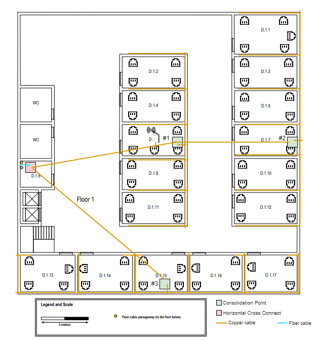

# RCOMP 2022/2023 - SPRINT 1 EDIFÍCIO D - 1211016 #

==============================================================================

## Introdução: ##
Este ficheiro tem o propósito de documentar o desenvolvimento de um projeto de cabeamento estruturado do Edifício D, que está dividido em dois pisos.

------------------------------------------------------------------------------------------------------------------------------------------------------------

## Índice: ##
1. **Considerações gerais e normativas de cabeamento**
2. **Abordagem no design da estrura de cabelagem do edifício**
3. **Regras de cabeamento e visão geral da estruturação do edifício D**
4. **Medidas e dimensões das divisões**
5. **Design da solução**
6. **Inventário**

------------------------------------------------------------------------------------------------------------------------------------------------------------
## 1. Considerações gerais e normativas de cabeamento ##

* O número de outlets por divisão standard é de **2 por cada 10m2** de área, num contexto empresarial, no entanto este número pode variar dependendo do uso que é dado à respetiva divisão.

* A localização de **cross connects** e **patch pannels** é definida de acordo com as normas da ISO/IEC 11801 e com o objetivo de minimizar o comprimento de cabos.

* Os **cabos de cobre** CAT6 (1Gbps) e CAT7 (10Gbps), limitados a um comprimento de 90m são utilizados para equipamento "end user" como PC's e impressoras uma vez que é o standard para estes equipamentos.

* Os **cabos de fibra ótica** podem ser utilizados nos cross connects, se estes o permitirem, uma vez que o comprimento e "data rate" permitido é bastante superior.

------------------------------------------------------------------------------------------------------------------------------------------------------------
## 2. Abordagem no design da estrutura de cabeamento do edifício ##

Para estruturar o cabeamento deste edifício, será utilizada uma abordagem, **bottom-up**,
que consiste em começar por levantar informação mais detalhada sobre as necessidades de cada divisão
e posteriormente, tomar decisões de design.

Assim, a abordagem segue os seguintes passos:

### 2.1 Medição da área das salas ###

* O primeiro passo consiste em medir a área de cada divisão, para que seja possível determinar o número de outlets necessários.

* Posteriormente, será possível determinar o número de cross connects e patch pannels necessários.

* Serão também considerados casos em que o número de outlets seja diferente do standard, devido a necessidades específicas de cada divisão.

### 2.2 Localizar a posição dos outlets em cada divisão ###

* Será necessário tomar em consideração a posição dos outlets, de forma a que seja razoável para a utilização nas workstations e access points.

### 2.3 Determinar a localização de cross connects ###

* A localização dos cross connects será determinada com vista a que esteja o mais central possível aos outlets servidos por estes e em salas pouco acessíveis pelo público.

* Primeiro serão colocados os CP (consolidation points), se necessário, posteriormente os HC (horizontal cross connects) e finalmente os IC (intermediate cross connects).

### 2.4 Definir cabelagem e roteamento de cabos ###

* Após saber o local dos outlets e cross connects, será possível definir a estrutura de cabeamento e o roteamento de cabos.

* Ligações redundantes são desejadas, pois garantem failover, e aumento de bandwidth com load balancing.

### 2.5 Definir tipos de cabos ###

* Em contexto horizontal, serão utilizados cabos de cobre CAT6 ou superior, entre os cross connects, serão preferidos cabos de fibra ótica, por causa dos seus benefícios em bandwidth e compatibilidade.

### 2.6 Manter um inventário ###

* Por fim, será apresentado um inventário com todo o material necessário para a implementação física da solução apresentada.

------------------------------------------------------------------------------------------------------------------------------------------------------------
## 3. Regras de cabeamento e estruturação geral do Edifício D ##

### 3.1 Estrutura do edifício ###
O edifício D é composto por dois pisos e ocupa um espaço de 30x30 metros.

                          Planta do piso 0 (presente no enunciado):

#### Considerações (piso 0) : ####

* A entrada de cabos no edifício é feita através de uma vala subterrânea com entrada na sala D.0.15, sala esta que tem condições para alojar um Cross Connect.
* Neste piso há passagem de cabos subterrânea.
* A altura das paredes é de 4m.
* A sala D.0.15 **não** necessita de outlets devido à sua função de alojamento de Cross Connects e de ser uma sala de armazenamento.
* O mesmo se aplica à sala D.0.0.16, halls de entrada, corredores e WC's.
* As salas D.0.1, D.0.2 e D.0.3 têm propósitos específicos e só precisam de 2 outlets perto de cada passagem de cabos.
* Nas restantes aplica-se o número de outlets por divisão standard.
* É necessária cobertura **WLAN (Wi-Fi)** em todo o piso.

                          Planta do piso 1 (presente no enunciado):

#### Considerações (piso 1) : ####

* A entrada de cabos no piso é feita por uma coluna com entrada na sala D.1.8, sala esta que tem condições para alojar Cross Connects.
* Neste piso **não** há passagem de cabos subterrânea.
* A altura das paredes é de 3m, no entanto, existe um teto falso com altura de 2,5m. O espaço entre os dois pode ser usado para roteamento de cabos e colocação de access points.
* A sala D.1.8 não necessita de Outlets devido à sua função de alojamento de Cross Connects e de ser uma sala de armazenamento.
* O mesmo se aplica à sala a halls de entrada, corredores e WC's.
* Nas restantes aplica-se o número de outlets por divisão standard.
* É necessária cobertura **WLAN (Wi-Fi)** em todo o piso.

------------------------------------------------------------------------------------------------------------------------------------------------------------
## 4. Medidas e dimensões das divisões ##

                          Dimensões do piso 0 :

                          Dimensões do piso 1 :

* A tabela seguinte apresenta as medidas das divisões do edifício D, bem como o número de outlets necessários para cada divisão.
* As medições das salas D.0.15, D.0.16 e D.1.8 não foram consideradas, uma vez que estas não necessitam de outlets.
* As medições das salas D.0.1, D.0.2 e D.0.3 não foram consideradas, uma vez que o número de outlets é diferente do standard.

| Divisão | Largura (m) | Comprimento (m) | Área (m2) | Nº de outlets |
|--------:|:-----------:|:---------------:|:---------:|:-------------:|
|   D.0.1 |     ---     |       ---       |    ---    |       6       |
|   D.0.2 |     ---     |       ---       |    ---    |       6       |
|   D.0.3 |     ---     |       ---       |    ---    |      10       |
|   D.0.4 |     3.2     |       6.6       |   21.12   |       4       |
|   D.0.5 |     3.2     |       6.6       |   21.12   |       4       |
|   D.0.6 |     3.2     |       6.6       |   21.12   |       4       |
|   D.0.7 |     3.2     |       6.6       |   21.12   |       4       |
|   D.0.8 |     3.2     |       6.6       |   21.12   |       4       |
|   D.0.9 |     3.2     |       6.6       |   21.12   |       4       |
|  D.0.10 |     3.2     |       6.6       |   21.12   |  4 + 1 (AP)   |
|  D.0.11 |     3.2     |       6.6       |   21.12   |       4       |
|  D.0.12 |     3.2     |       6.6       |   21.12   |       4       |
|  D.0.13 |     3.2     |       6.6       |   21.12   |       4       |
|  D.0.14 |     3.2     |       6.6       |   21.12   |       4       |
|  D.0.15 |     ---     |       ---       |    ---    |       0       |
|  D.0.16 |     ---     |       ---       |    ---    |       0       |
|   D.1.1 |    4.15     |       6.6       |   27.39   |       5       |
|   D.1.2 |     3.2     |       6.6       |   21.12   |       4       |
|   D.1.3 |     3.2     |       6.6       |   21.12   |       4       |
|   D.1.4 |     3.2     |       6.6       |   21.12   |       4       |
|   D.1.5 |     3.2     |       6.6       |   21.12   |       4       |
|   D.1.6 |     3.2     |       6.6       |   21.12   |  4 + 1 (AP)   |
|   D.1.7 |     3.2     |       6.6       |   21.12   |       4       |
|   D.1.8 |     ---     |       ---       |    ---    |       0       |
|   D.1.9 |     3.2     |       6.6       |   21.12   |       4       |
|  D.1.10 |     3.2     |       6.6       |   21.12   |       4       |
|  D.1.11 |     3.2     |       6.6       |   21.12   |       4       |
|  D.1.12 |     3.2     |       6.6       |   21.12   |       4       |
|  D.1.13 |    3.77     |      5.85       |   22.05   |       4       |
|  D.1.14 |    3.77     |      5.85       |   22.05   |       4       |
|  D.1.15 |    3.77     |      5.47       |   20.62   |       4       |
|  D.1.16 |    3.77     |      5.47       |   20.62   |       4       |
|  D.1.17 |    3.77     |      5.47       |   20.62   |       4       |

Nº de outlets no piso 0: 66 + 1 reservado para o Access Point

Nº de outlets no piso 1: 65 + 1 reservado para o Access Point

Total: 133 outlets

------------------------------------------------------------------------------------------------------------------------------------------------------------
## 5. Design da solução ##

### 5.1. Esquema do layout das outlets ###

                          Outlets do piso 0 :

    
                          Outlets do piso 1 :

#### Considerações (posicionameto de outlets) : ####

* O posicionamento das outlets foi feito de forma a que estivessem o mais dispersas entre si, para ser possível a instalação de workstations e outros dispositivos em praticamente qualquer ponto das divisôes.
* Todos os outlets estão "embutidos" nas paredes, para não haverem cabos expostos.
* Os outlets dedicados aos Access Points ocupam uma posição central em cada um dos pisos para a cobertura do seu alcance (30m de raio) fosse suficiente para todo o piso.
* O número de outlets por sala segue as especificações do enunciado.

### 5.2. Esquema do layout dos cross-connects e cabeamento ###

                           piso 0 :

#### Considerações (design piso 0) : ####

* A sala D.0.15 foi escolhida para acolher o IC (Intermediate Cross-connect) e o HC deste piso.
* O IC está conectado ao exterior através de um cabo de fibra ótica (até ao Main Cross-connect do piso A).
* O patch pannel do IC apenas terá 12 portas, uma vez que só terá ligação ao Main Cross-connect e aos dois HC's, havendo a possíbilidade de 4 ligações redundantes a estes em configuração **LAG**.
* Todas as conexões entre o os cross-connects são feitas através de cabos de fibra ótica.
* As ligações entre Consolidation Points e outlets são feitas através de cabos de cobre.
* O patch pannel do HC está dividido em 2 partes, uma para as ligações ao IC e outra para as ligações aos CP's. Por estar ligado a 4 dispositivos, este terá que ter 24 portas, para manter a mesma configuração do IC.
* Os CP's deverão ter patch pannels com 48 portas para acomodar a ligação às outlets (cabo de cobre) que servem e poderem ter ligações redundantes (LAG) aos HC's (cabo de fibra ótica).
* **O access point** foi colocado num outlet da sala D.0.10, ocupando uma posição central de forma a cobrir todo o piso 0 (raio de 30m).
* As ligações com cabos foram todas passadas pelas canaletas existentes no chão.

                           piso 1 :

#### Considerações (design piso 1) : ####

* A sala D.1.8 foi escolhida para acolher o HC deste piso.
* Neste caso, não havendo canaletas no chão, os cabos foram passados pelo teto falso, o que permitiu ligações mais diretas, como se pode ver na figura.
* O HC deste piso está conectado ao IC do piso 0 através de um cabo de fibra ótica.
* Mais uma vez, o access point foi colocado numa posição central, pelas mesmas razões, no entanto com um ligeiro offset em relação ao AP do piso inferior e com um canal Wi-Fi distinto para evitar interferências.
* Tal como no piso inferior, o patch pannel do HC está dividido em 2 partes, uma para as ligações ao IC e outra para as ligações aos CP's. Por estar ligado a 4 dispositivos, este terá que ter 24 portas, para manter a mesma configuração do IC.
* Os CP's deverão ter patch pannels com 48 portas para acomodar a ligação às outlets (cabo de cobre) que servem e poderem ter ligações redundantes (LAG) aos HC's (cabo de fibra ótica).
* As ligações com cabos de fibra ótica foram todas passadas pelo teto falso, as restantes, por furos entre as paredes.

## 6. Inventário ##

### 6.1. Comprimento de cabos ###

                           piso 0 :
**Fio de cobre Cat6a**

Para calcular o comprimento de fio de cobre necessário para os outlets, foi utilizada a seguinte fórmula:

    comprimento total = nº de outlets x (comprimento médio + altura do HC)

Para calcular o comprimento de fio de cobre necessário para o access point, foi utilizada a seguinte fórmula:

    comprimento total = comprimento até ao AP

| Divisão | Nº de outlets | Comprimento total aproximado (m) |
|--------:|:-------------:|:--------------------------------:|
|   D.0.1 |       6       |      6 * (11.3 + 1) = 73.8       |
|   D.0.2 |       6       |       6 * (2.8 + 1) = 22.8       |
|   D.0.3 |      10       |      10 * (14.2 + 1) = 152       |
|   D.0.4 |       4       |      4 * (11.3 + 1) = 49.2       |
|   D.0.5 |       4       |      4 * (7.54 + 1) = 34.16      |
|   D.0.6 |       4       |      4 * (3.77 + 1) = 19.08      |
|   D.0.7 |       4       |      4 * (7.54 + 1) = 34.16      |
|   D.0.8 |       4       |      4 * (11.3 + 1) = 49.2       |
|   D.0.9 |       4       |      4 * (15.1 + 1) = 64.4       |
|  D.0.10 |     4 + 1     |      5 * (7.54 + 1) = 42.7       |
|  D.0.11 |       4       |      4 * (3.77 + 1) = 19.08      |
|  D.0.12 |       4       |      4 * (7.54 + 1) = 34.16      |
|  D.0.13 |       4       |      4 * (11.3 + 1) = 49.2       |
|  D.0.14 |       4       |      4 * (15.1 + 1) = 64.4       |

1 Access Point:   
-> 1.9 m

Total: 710.24 + 35.51 (margem de segurança de 5%) = 745.75 m

**Fibra ótica de modo único**

Ligações entre o IC e os HC's (2):   
-> 4 * 1 = 4 m   
-> 4 * 5 = 20 m (para o piso superior)

3 Consolidation Points:   
-> 4 * (15.1 + 1) = 64,40 m   
-> 4 * (27.35 + 1) = 113.43 m   
-> 4 * (33.01 + 1) = 136.08 m   

Total: 337.91 + 16.89 (margem de segurança de 5%) = 354.8 m

**Patch panels e patch cords**

Dado que no piso 0 existem 67 outlets, serão necessários pelo menos 3 patch panels de 24 portas. No entanto, é recomendável que os CP's que sirvam um número próximo de 24 outlets tenham patch panels de 48 portas.

Serão necessários 67 patch cords para ligar os patch panels aos outlets.

                           piso 1 :
**Fio de cobre Cat6a**

Para calcular o comprimento de fio de cobre necessário para os outlets, foi utilizada a seguinte fórmula:

    comprimento total = nº de outlets x (comprimento médio + altura do teto amovível + altura do HC)

Para calcular o comprimento de fio de cobre necessário para o access point, foi utilizada a seguinte fórmula:

    comprimento total = comprimento até ao AP

| Divisão | Nº de outlets | Comprimento total aproximado (m) |
|--------:|:-------------:|:--------------------------------:|
|   D.1.1 |       5       |    5 * (15.1 + 2.5 + 1) = 93     |
|   D.1.2 |       4       |   4 * (11.3 + 2.5 + 1) = 59.2    |
|   D.1.3 |       4       |   4 * (11.3 + 2.5 + 1) = 59.2    |
|   D.1.4 |       4       |   4 * (7.54 + 2.5 + 1) = 44.16   |
|   D.1.5 |       4       |   4 * (7.54 + 2.5 + 1) = 44.16   |
|   D.1.6 |     4 + 1     |   5 * (3.77 + 2.5 + 1) = 36.35   |
|   D.1.7 |       4       |   4 * (3.77 + 2.5 + 1) = 29.08   |
|   D.1.9 |       4       |   4 * (7.54 + 2.5 + 1) = 44.16   |
|  D.1.10 |       4       |   4 * (7.54 + 2.5 + 1) = 44.16   |
|  D.1.11 |       4       |   4 * (11.3 + 2.5 + 1) = 59.2    |
|  D.1.12 |       4       |   4 * (11.3 + 2.5 + 1) = 59.2    |
|  D.1.13 |       4       |   4 * (14.2 + 2.5 + 1) = 70.8    |
|  D.1.14 |       4       |     4 * (8.5 + 2.5 + 1) = 48     |
|  D.1.15 |       4       |    4 * (4.7 + 2.5 + 1) = 32.8    |
|  D.1.16 |       4       |     4 * (8.5 + 2.5 + 1) = 48     |
|  D.1.17 |       4       |   4 * (13.2 + 2.5 + 1) = 66.8    |

1 Access Point:    
-> 1.9 m   

Total: 840.17 + 42.0 (margem de segurança de 5%) = 882.17 m

**Fibra ótica de modo único**

3 Consolidation Points:   
-> 4 * (15.1 + 2.5 + 1) = 74.4 m   
-> 4 * (17.0 + 2.5 + 1) = 82 m   
-> 4 * (28.3 + 2.5 + 1) = 127.2 m   
  
Total: 283.4 + 14.17 (margem de segurança de 5%) = 297.57 m   

**Patch panels e patch cords**

Dado que no piso 1 existem 66 outlets, serão necessários pelo menos 3 patch panels de 24 portas. No entanto, é recomendável que os CP's que sirvam um número próximo de 24 outlets tenham patch panels de 48 portas.

Serão necessários 66 patch cords para ligar os patch panels aos outlets.

### 6.2 Inventário ###

|            | Fio de cobre Cat6a (m) | Fio de fibra ótica modo único (m) | Outlets | Access Points | Patch Panels | Patch Cords |
|------------|:----------------------:|:---------------------------------:|:-------:|:-------------:|:------------:|:-----------:|
| **Piso 0** |         745.75         |               354.8               |   67    |       1       |      5       |     67      |
| **Piso 1** |         882.17         |              297.57               |   66    |       1       |      4       |     66      |
| **Total**  |        1627.92         |              652.37               |   133   |       2       |      9       |     133     |   

**No caso dos patch pannels...**
* O IC tem patch panel de 12 portas.
* Os HC's têm patch panels de 24 portas.
* Os CP's têm patch panels de 48 portas.

**No caso das estruturas de suporte (armários)**
* 6 armários de 8U para todos os CP's + 1 armário de 8U para o (IC + HC) do piso 0
* 1 armário de 4U para o HC do piso 1
