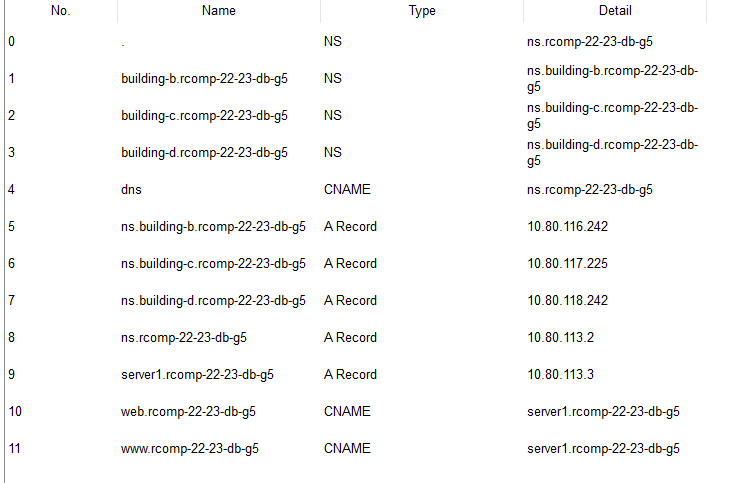

## RCOMP 2022/2023 - SPRINT 3 EDIFÍCIO A - 1211148 ##

===========================================================================

### Introdução: ###
Este ficheiro documenta as simulações do edifício A, referentes ao sprint 3.

------------------------------------------------------------------------------------------------------------------------------------------------------------

### Índice: ###
1. **Base de dados DNS no servidor DNS**
2. **DHCP implementação**
3. **OSPF implementação**
4. **VOIP implementação**
5. **Implementação teórica do NAT**
6. **Implementação da Firewall**

------------------------------------------------------------------------------------------------------------------------------------------------------------

### 1. Base de dados DNS no servidor DNS ###

* Servidor DNS do Edificio A:
  * IP: 10.80.113.2
  * Nome: rcomp-22-23-db-g5

* Servidor HTTP do Edifício A (A_F1_SERVER):
  * IP: 10.80.113.3

* * A base de dados DNS encontra-se descrita na seguinte imagem:

------------------------------------------------------------------------------------------------------------------------------------------------------------

## 2. DHCP implementação ##
Para estabelecer o DHCP, foram executadas as seguintes configurações no router do building A:

    ip dhcp excluded-address 10.80.112.129
    ip dhcp excluded-address 10.80.113.129
    ip dhcp excluded-address 10.80.112.1
    ip dhcp excluded-address 10.80.112.65

    (excluded the router's IP for Wifi, Floor 1, Floor 0 and VoIP vlans)

    ip dhcp pool NET-388
    network 10.80.113.128 255.255.255.128
    default-router 10.80.113.129
    dns-server 10.80.113.2
    domain-name rcomp-22-23-db-g5

    ip dhcp pool NET-389
    network 10.80.112.0 255.255.255.192
    default-router 10.80.112.1
    dns-server 10.80.113.2
    domain-name rcomp-22-23-db-g5

    ip dhcp pool NET-390
    network 10.80.112.64 255.255.255.192
    default-router 10.80.112.65
    option 150 ip 10.80.112.65
    dns-server 10.80.113.2
    domain-name rcomp-22-23-db-g5

    ip dhcp pool NET-386
    network 10.80.112.128 255.255.255.128
    default-router 10.80.112.129
    dns-server 10.80.113.2
    domain-name rcomp-22-23-db-g5

## 3. OSPF implementação ##
Para estabelecer o OSPF no building A, foi apenas necessário definir a área de backbone e a área do próprio edifício:

    router ospf 1
    log-adjacency-changes
    network 10.80.112.0 0.0.1.255 area 1
    network 10.80.115.0 0.0.0.127 area 0
    default-information originate

* Nota:
* default-information originate: Este comando instrui o router a anunciar uma rota padrão no domínio OSPF. 
* Isso é útil quando o router está conectado à internet ou a um default gateway e deseja informar aos 
* outros routers OSPF que ele pode alcançar redes fora do domínio OSPF.

## 4. VOIP implementação ##
Para criar o serviço VOIP, foi primeiro necessário estabelecer as ligações entre edifícios.
    
    dial-peer voice 20 voip
    destination-pattern 2
    session target ipv4:10.80.115.2
    
    dial-peer voice 30 voip
    destination-pattern 3
    session target ipv4:10.80.115.3
    
    dial-peer voice 40 voip
    destination-pattern 4
    session target ipv4:10.80.115.4

    (IP dos routers dos edifícios B, C e D)

e posteriormente configurar os próprios telefones:

    telephony-service
    max-ephones 10
    max-dn 10
    ip source-address 10.80.112.65 port 2000
    auto assign 1 to 2
    
    ephone-dn 1
    number 1000
    
    ephone-dn 2
    number 1001

    ephone 1
    device-security-mode none
    mac-address 0001.4378.87B7
    type 7960
    button 1:1
    
    ephone 2
    device-security-mode none
    mac-address 0060.47A3.D26C
    type 7960
    button 1:2

## 5. Implementação teórica do NAT ##
Uma vez que no packet tracer haviam problemas na implementação do NAT, derivados da própria simulação, aqui fica a implementação teórica do NAT:
Primeiro, seria necessário definir as interfaces inside e outside:

    ip nat inside source 10.80.113.1 (interface DMZ)
    ip nat outside source 10.80.115.1 (interface Backbone)

Posteriormente, seria necessário definir as rotas estáticas:

    syntax: ip nat inside source static <prtocol> <inside local IP> <inside local port> <outside global IP> <outside global port>
    
    ip nat inside source static tcp 10.80.113.3 443 10.80.115.1 443
    ip nat inside source static tcp 10.80.113.3 80 10.80.115.1 80
    ip nat inside source static tcp 10.80.113.2 53 10.80.115.1 53
    ip nat inside source static udp 10.80.113.2 53 10.80.115.1 53
    
    Servidor HTTP: 10.80.113.3
    
    Servidor DNS: 10.80.113.2
    
    Sub-interface backbone: 10.80.115.1

## 6. Implementação da Firewall ##
A implementação da firewall foi baseada em listas de acesso, que foram aplicadas nas sub-interfaces do router.

Access List para a sub-interface wifi: ACL 101
Access List para a sub-interface floor 1: ACL 102
Access List para a sub-interface floor 0: ACL 103
Access List para a sub-interface voip: ACL 104
Access List para bloquear spoofing externo: ACL 100

As access lists têm o seguinte aspeto genérico:

    access-list x deny ip any host 10.80.112.1
    access-list x deny ip any host 10.80.112.65
    access-list x deny ip any host 10.80.112.129
    access-list x deny ip any host 10.80.113.1
    access-list x deny ip any host 10.80.113.129
    access-list x permit icmp any 10.80.113.0 0.0.0.127 echo-reply
    access-list x permit tcp any 10.80.113.0 0.0.0.127 eq www
    access-list x permit tcp any 10.80.113.0 0.0.0.127 eq 443
    access-list x permit udp any 10.80.113.0 0.0.0.127 eq domain
    access-list x deny ip any 10.80.113.0 0.0.0.127
    access-list x permit ip x.x.x.x 0.0.0.x any
    access-list x permit udp any eq bootpc any eq bootps

Posteriormente, as access lists foram aplicadas nas sub-interfaces:

      interface FastEthernet0/0.x
      ip access-group x in

## RCOMP SPRINT 3 checklist ##

* [x] OSPF
* [x] DHCP
* [x] VOIP
* [x] Adding a second server to each DMZ network to run the HTTP service.
* [x] Configuring DNS servers to establish a DNS domain tree
* [x] NAT
* [x] Firewall
